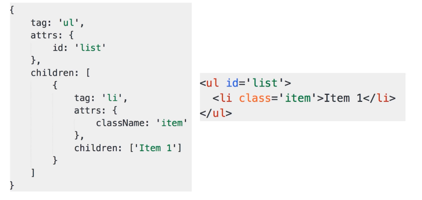

#### vdom 是什么？为何会存在 vdom

- 虚拟 DOM 结构，用 JS 模拟 DOM 结构

- DOM 变化的对比，放在 JS 层在做
- 提高重绘性能
- 浏览器操作 DOM 的成本非常高，执行 JS 能力很高 

- tag		    标签名
- attrs            标签上的属性
- children      标签里的内容或者嵌套的子元素

#### vdom 的如何应用，核心API是什么

- 可以通过 snabbdom 库去使用。核心是 Patch  和 h 函数
- `h()`
- `patch()` 
  - patch(container, vnode)
  - patch(vnode, newVnode)

#### 介绍一下 diff 算法

- DOM 的操作是昂贵的，因此尽量减少 DOM 操作
- 找出本次 DOM 必须更新的节点来更新，其他不更新
- 这个过程，就是 diff 算法

diff 是 linux 的基本命令，git diff 

