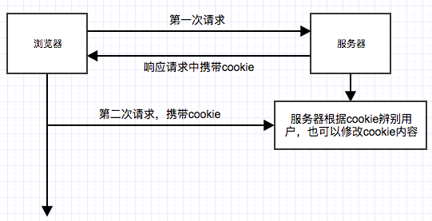

## Cookie

> 为什么会有 Cookie

HTTP 协议是无状态的，HTTP 协议自身不对请求和响应之间的通信状态进行保存

> 什么是 Cookie

Cookie 指某些网站为了辨别用户身份而储存在用户本地终端上的数据(通常经过加密，如 token )。

通过给每个不同的客户端一些带有特定信息的 Cookie，就可以在每次请求的时候，服务器获取到一些期望获取的信息，比如知道这次访问的用户是谁( token )。

-   其实 `Cookie` 就是一种浏览器管理状态的一个文件。


```
name:一个唯一确定的 cookie 名称。通常来讲 cookie 的名称是不区分大小写的。

value:存储在 cookie 中的字符串值。最好为 cookie 的 name 和 value 进行 url 编码

domain:cookie 对于哪个域是有效的。所有向该域发送的请求中都会包含这个 cookie 信息。同一个域名下的二级域名是不可以交换使用cookie的，比如，你设置www.baidu.com和image.baidu.com, 是不能公用的

path: 表示这个 cookie 影响到的路径，浏览器跟会根据这项配置，像指定域中匹配的路径发送 cookie。

expires:失效时间，表示 cookie 何时应该被删除的时间戳(也就是，何时应该停止向服务器发送这个 cookie)。如果不设置这个时间戳，浏览器会在页面关闭时即将删除所有 cookie；不过也可以自己设置删除时间。这个值是 GMT 时间格式，如果客户端和服务器端时间不一致，使用 expires 就会存在偏差。

max-age: 与 expires 作用相同，用来告诉浏览器此 cookie 多久过期（单位是秒），而不是一个固定的时间点。正常情况下，max-age 的优先级高于 expires。

HttpOnly: 告知浏览器不允许通过脚本 document.cookie 去更改这个值，同样这个值在 document.cookie 中也不可见。但在 http 请求张仍然会携带这个 cookie。注意这个值虽然在脚本中不可获取，但仍然在浏览器安装目录中以文件形式存在。这项设置通常在服务器端设置。

secure: 安全标志，指定后，只有在使用 SSL 链接时候才能发送到服务器，如果是 http 链接则不会传递该信息。就算设置了 secure 属性也并不代表他人不能看到你机器本地保存的 cookie 信息，所以不要把重要信息放 cookie 就对了
```

> Cookie 的原理

第一次访问网站的时候，浏览器发出请求，服务端响应请求后，会将 Cookie 放在请求中，在浏览器第二次发请求的时候，会把 Cookie 带过去，服务端会辨别用户身份。



> Cookie 生成的方式

Cookie 生成有两种方式，

-   在服务端通过 `setHeader` 的 `set-cookie` 生成，这时候，响应会将这个 Cookie 直接写进浏览器中

-   客户端通过 `document.cookie` 去生成

> Cookie 的缺陷

-   Cookie 会被附加在每个 HTTP 请求中，无形中增加了一些不必要的流量损失。

-   不安全，由于 HTTP 请求是明文传输，所以安全性是个问题，可以设置 `HttpOnly` 和 `secure` 增加安全性

-   存储容量，一般浏览器对每个域可容纳 20 条 Cookie，每个 Cookie 不能超过 4KB


> set-Cookie in Node serve

```
const http = require("http");

http.createServer((req, res) => {
    res.setHeader("status", "200 ok");
    res.setHeader("Set-Cookie", "name=glory;HttpOnly;max-age=2000");
    res.write("Hello World");
    res.end();
}).listen(3000);

console.log("http serve on localhost:3000")
```