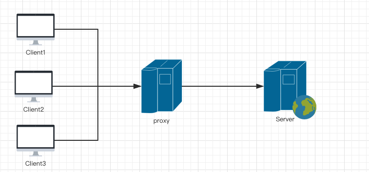
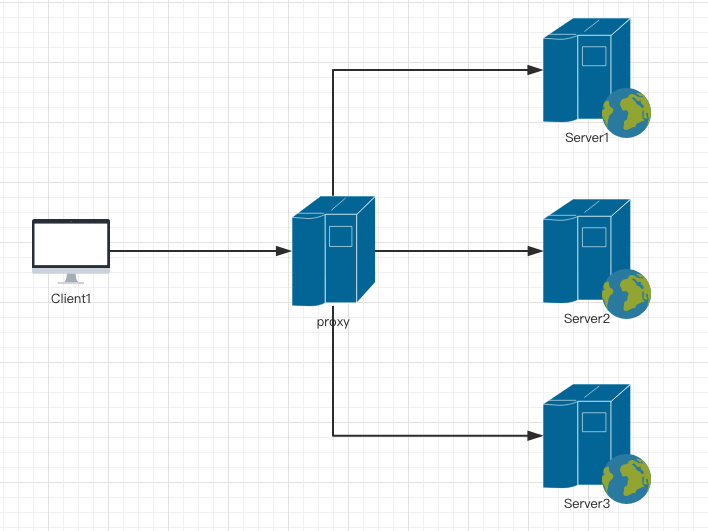

> 正向代理

有些网站我们不能去访问，比如国外的网站需要翻墙工具才能访问的，这时候，搭建可访问这些网站的代理服务器，将我们的请求代理给这个代理服务器，通过它去访问这些网站，并将信息传递回来。这就是正向代理，客户端知道服务端具体的 IP，通过 Proxy 服务去访问。

> 反向代理

现在基本所有的大型网站的页面都是用了反向代理，客户端发送的请求，想要访问 serve 服务器上的内容，发送的请求其实是被发送到了代理服务器，并不是真正获取内容的服务器，这个代理服务器再将请求发送到它自己设置好的内部服务器上获取内容返回。

> 反向代理的用途和好处

安全性：正向代理的客户端能够在隐藏自身信息的同时访问任意网站，这个给网络安全带来了极大的威胁。因此，我们必须把服务器保护起来，使用反向代理客户端用户只能通过外来网访问代理服务器，并且不知道自己访问的真实服务器是哪一台，可以很好的提供安全保护。

功能性：反向代理的主要用途是为多个服务器提供负载均衡、缓存等功能。负载均衡就是一个网站的内容被部署在若干个服务器上，可以把这些机子看成一个集群，那 Nginx 可以将接收的客户端请求均匀地分配到这个集群的所有服务器上，从而实现服务器压力的平均分配。